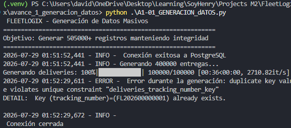
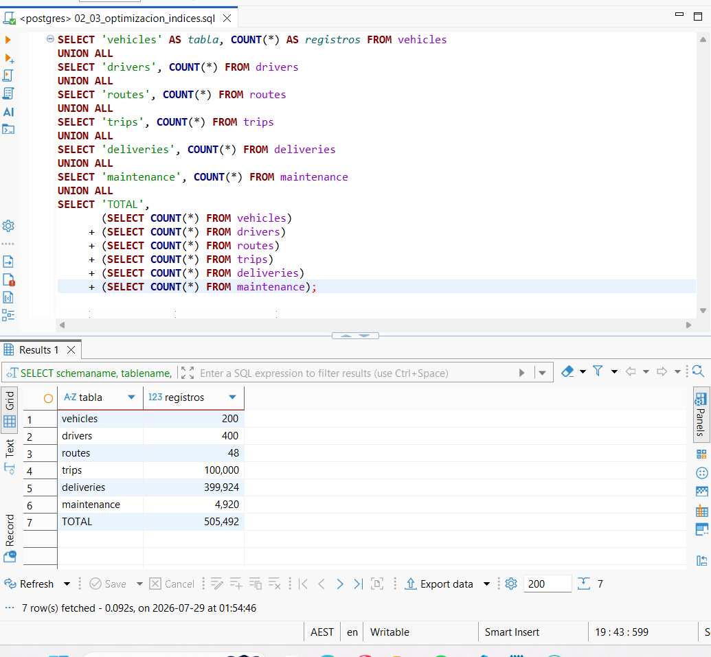
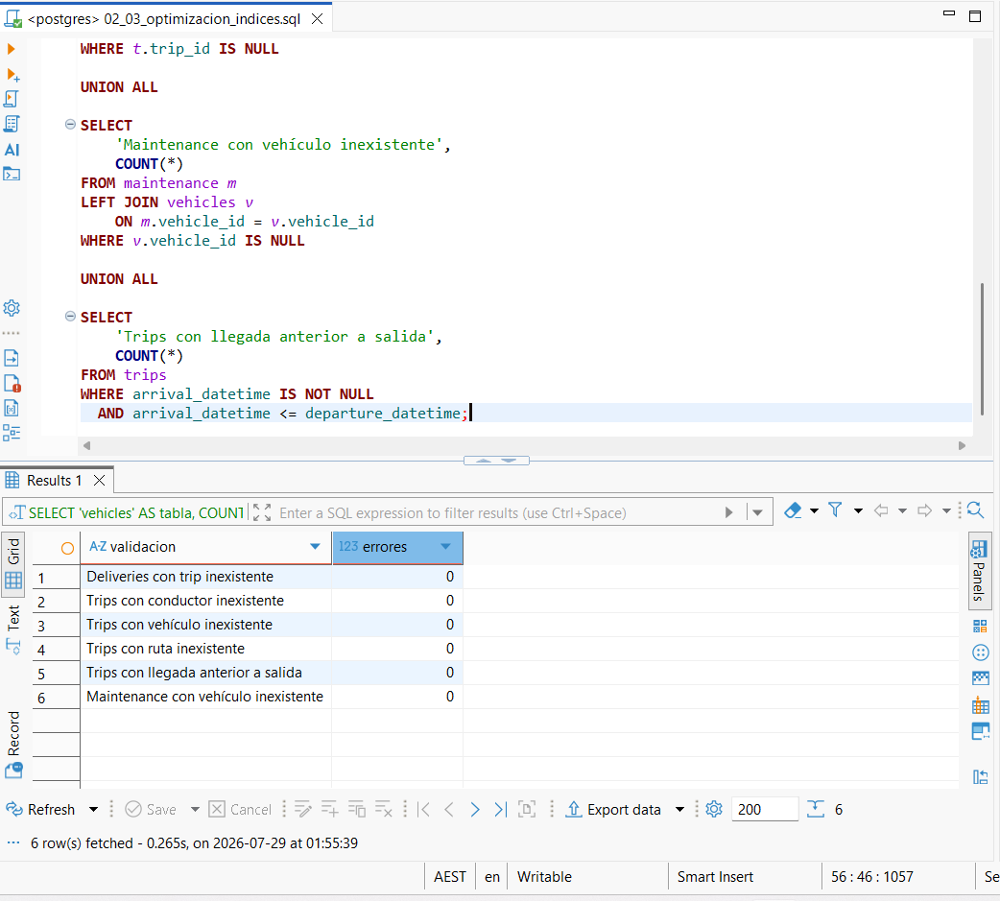

# Avance 1 — Generación de Datos Sintéticos

## FleetLogix

Este avance corresponde a la generación de datos sintéticos para la base de datos operacional de **FleetLogix**, una empresa dedicada al transporte y logística de última milla.

El objetivo fue poblar el modelo relacional proporcionado en PostgreSQL con un gran volumen de información realista, respetando las relaciones entre tablas, las reglas de negocio y la integridad referencial.

---

# Objetivos

- Analizar el modelo relacional proporcionado.
- Generar datos sintéticos consistentes mediante Python.
- Poblar las seis tablas de PostgreSQL.
- Mantener la integridad referencial entre todas las entidades.
- Implementar inserciones masivas para mejorar el rendimiento.
- Validar la calidad de los datos generados.

---

# Tecnologías utilizadas

- Python 3
- PostgreSQL
- Faker
- Pandas
- NumPy
- Psycopg2
- tqdm
- JSON
- Logging

---

# Modelo de datos

El modelo operacional está compuesto por seis tablas:

| Tabla | Descripción |
|-------|-------------|
| vehicles | Vehículos de la flota |
| drivers | Conductores |
| routes | Rutas entre ciudades |
| trips | Viajes realizados |
| deliveries | Entregas |
| maintenance | Historial de mantenimiento |

Las relaciones entre tablas fueron respetadas mediante claves primarias y claves foráneas.

---

# Generación de datos

El proceso fue desarrollado en:

```text
A1-01_data_generation_estudiantes.py
```

El script utiliza:

- Faker para generar información sintética.
- NumPy y Random para distribuciones reproducibles.
- Psycopg2 para conectarse a PostgreSQL.
- execute_batch() para realizar inserciones masivas.

Las semillas fueron fijadas para garantizar resultados reproducibles:

```python
Faker.seed(42)
random.seed(42)
np.random.seed(42)
```

---

# Volumen de datos generado

El proceso generó la siguiente cantidad de registros:

| Tabla | Registros |
|-------|----------:|
| vehicles | 200 |
| drivers | 400 |
| routes | 48 |
| trips | 100,000 |
| deliveries | 399,924 |
| maintenance | 4,920 |
| **TOTAL** | **505,492** |

---

# Orden de carga

Para respetar las restricciones de claves foráneas, las tablas fueron pobladas en el siguiente orden:

```text
vehicles
    ↓
drivers
    ↓
routes
    ↓
trips
    ↓
deliveries
    ↓
maintenance
```

Este orden garantiza que todas las relaciones sean válidas durante el proceso de inserción.

---

# Reglas de negocio implementadas

Durante la generación se respetaron las siguientes reglas:

- Cada viaje pertenece a un vehículo existente.
- Cada viaje pertenece a un conductor existente.
- Cada viaje utiliza una ruta válida.
- Cada entrega pertenece a un viaje existente.
- Cada mantenimiento corresponde a un vehículo existente.
- La fecha de llegada siempre es posterior a la fecha de salida.
- Los identificadores permanecen únicos.
- Las rutas conectan ciudades diferentes.

---

# Validaciones realizadas

Al finalizar la generación se ejecutaron diferentes validaciones para verificar la calidad de los datos.

Se comprobó que:

- No existen viajes sin vehículo.
- No existen viajes sin conductor.
- No existen viajes sin ruta.
- No existen entregas sin viaje.
- No existen mantenimientos sin vehículo.
- No existen inconsistencias entre fechas de salida y llegada.

Todas las validaciones obtuvieron **0 errores**, garantizando la integridad referencial de la base de datos.

---

# Inserción masiva

Para mejorar el rendimiento durante la carga se utilizó:

```python
execute_batch()
```

Esta técnica permitió insertar grandes volúmenes de información de manera eficiente, reduciendo significativamente el tiempo de ejecución frente a inserciones individuales.

---

# Archivos generados

Durante la ejecución también se generan archivos auxiliares:

```text
data_generation.log
```

Registro completo del proceso de generación.

```text
generation_summary.json
```

Resumen con estadísticas finales y validaciones realizadas.

---

# Ejecución

## Instalar dependencias

```bash
pip install psycopg2-binary pandas numpy faker tqdm
```

## Configurar PostgreSQL

Modificar las credenciales dentro del script:

```python
DB_CONFIG = {
    "host": "localhost",
    "database": "fleetlogix",
    "user": "postgres",
    "password": "********",
    "port": 5432
}
```

## Ejecutar

```bash
python A1-01_data_generation_estudiantes.py
```

---

# Evidencias

Las evidencias utilizadas para validar este avance se encuentran en la carpeta:

```text
evidencias/
```

## Ejecución del script



---

## Conteo de registros generados



---

## Validación de integridad referencial



---

# Resultados

Se logró poblar la base de datos operacional de FleetLogix con más de **505 mil registros**, manteniendo la integridad entre todas las tablas del modelo.

El uso de generación sintética permitió construir un entorno de prueba realista sin utilizar información confidencial.

La implementación de inserciones masivas facilitó la carga eficiente de un gran volumen de datos, mientras que las validaciones finales confirmaron la consistencia e integridad de la información generada.

Este avance constituye la base para el desarrollo de los análisis SQL, el proceso ETL y el Data Warehouse implementados en los siguientes avances del proyecto.

---

# Autor

**David Cuastumal**

Proyecto Integrador — Módulo 2  
SoyHenry