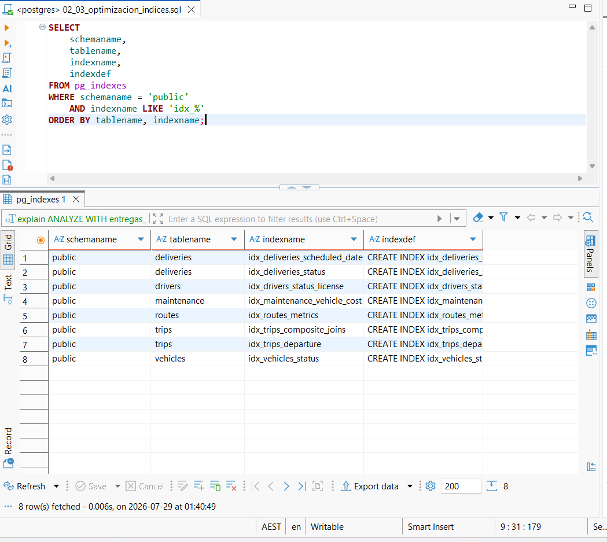
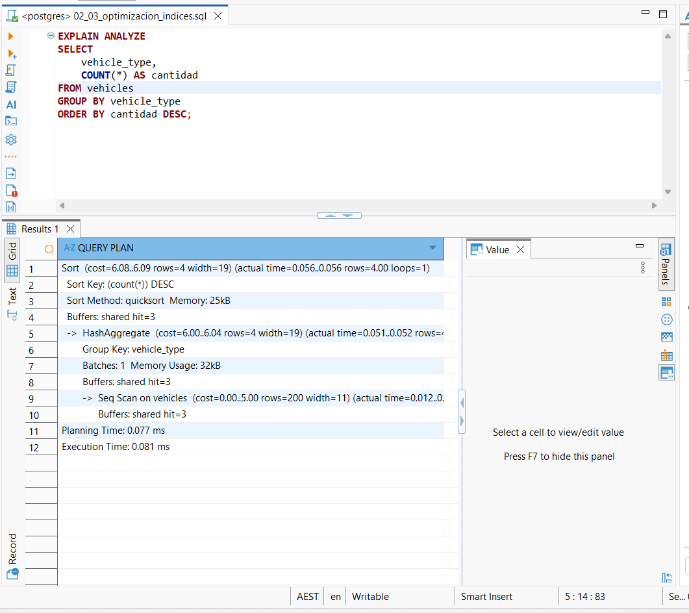
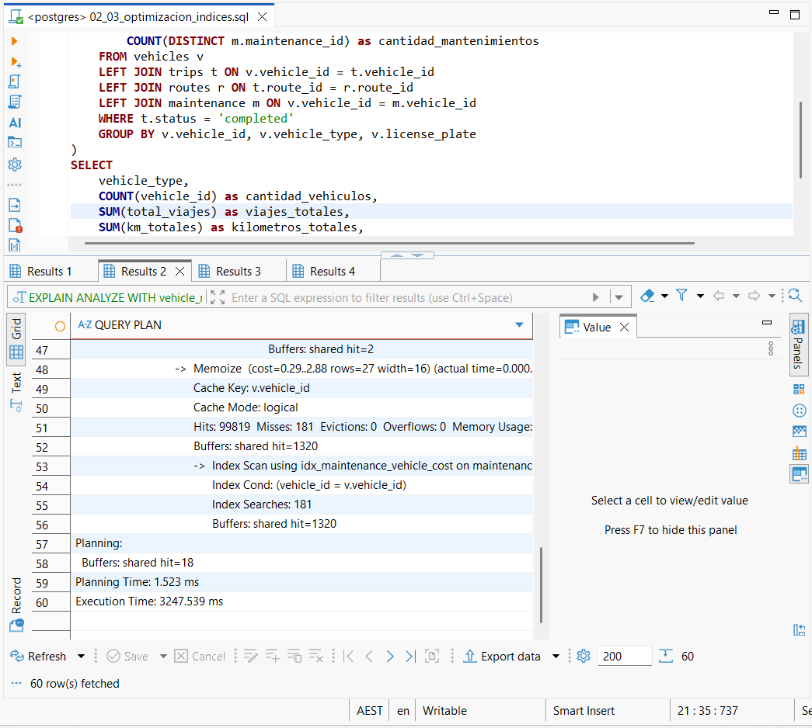

# Avance 2 - Análisis SQL y Optimización de Consultas

## Descripción

En este avance se realizó el análisis y la optimización del rendimiento de las consultas SQL desarrolladas para el proyecto **FleetLogix**.

El objetivo fue evaluar el comportamiento de las consultas sobre PostgreSQL, identificar posibles oportunidades de mejora e implementar índices estratégicos que permitieran reducir los tiempos de ejecución de las consultas más costosas.

Para validar el impacto de la optimización, se registraron los tiempos de ejecución antes y después de aplicar los índices, utilizando la herramienta `EXPLAIN ANALYZE`.

---

# Objetivos

- Analizar el rendimiento de las consultas SQL.
- Registrar los tiempos de ejecución iniciales.
- Optimizar las consultas mediante índices.
- Comparar el rendimiento antes y después de la optimización.
- Documentar el proceso y sus resultados.

---

# Tecnologías utilizadas

- PostgreSQL
- SQL
- DBeaver
- EXPLAIN ANALYZE
- Índices B-Tree

---

# Metodología

El proceso de optimización se desarrolló en cuatro etapas.

## 1. Ejecución inicial de las consultas

Se ejecutaron las doce consultas SQL del proyecto sobre la base de datos sin aplicar optimizaciones adicionales.

Para cada consulta se registró:

- Consulta ejecutada.
- Resultado obtenido.
- Tiempo de ejecución.
- Captura de pantalla como evidencia.

Estas mediciones fueron utilizadas como línea base para evaluar posteriormente el impacto de los índices.

---

## 2. Optimización mediante índices

Posteriormente se ejecutó el script:

```text
A2-03_optimization_indexes.sql
```

Este script creó índices sobre las tablas más utilizadas por las consultas analíticas, mejorando especialmente operaciones de:

- JOIN
- Búsquedas por fecha
- Agrupaciones
- Filtros
- Consultas sobre mantenimiento
- Consultas sobre rutas
- Consultas sobre entregas

### Evidencia
### Índices implementados

Para verificar la correcta creación de los índices, se consultó la vista del sistema `pg_indexes`, donde se muestran los índices generados para las tablas del proyecto.



---

## 3. Nueva ejecución utilizando EXPLAIN ANALYZE

Después de crear los índices se ejecutaron nuevamente las doce consultas utilizando:

```sql
EXPLAIN ANALYZE
```

Con ello fue posible obtener:

- Plan de ejecución.
- Tipo de acceso utilizado por PostgreSQL.
- Tiempo de ejecución optimizado.

### Ejemplo de consulta sencilla



### Ejemplo de consulta compleja



---

# Comparación de tiempos

| Consulta | Antes (ms) | Después (ms) |
|-----------|-----------:|-------------:|
| Q1 | 6 | 0.081 |
| Q2 | 4 | 0.071 |
| Q3 | 19 | 15.072 |
| Q4 | 68 | 62.431 |
| Q5 | 32 | 83.240 |
| Q6 | 287 | 355.952 |
| Q7 | 96 | 50.185 |
| Q8 | 190 | 25.913 |
| Q9 | 14000 | 3247.539 |
| Q10 | 160 | 238.172 |
| Q11 | 67 | 97.014 |
| Q12 | 247 | 74.047 |

---

# Evidencias

Las capturas correspondientes a las doce consultas ejecutadas antes y después de la optimización se encuentran organizadas dentro de la carpeta:

```
evidencias/
├── antes/
├── despues/
└── create_indexes.png
```

Esta organización permite revisar el proceso completo de optimización sin sobrecargar la documentación principal.

---

# Resultados

El análisis permitió comprobar que:

- Las consultas simples ya presentaban tiempos de respuesta muy bajos.
- Las consultas con múltiples JOIN y agregaciones fueron las que obtuvieron mayores beneficios.
- PostgreSQL comenzó a utilizar los índices creados cuando estos representaban una mejora en el plan de ejecución.
- La consulta más costosa redujo su tiempo de ejecución de aproximadamente **14 segundos** a **3.25 segundos**, representando una mejora cercana al **77%**.

---

# Conclusiones

La implementación de índices permitió mejorar significativamente el rendimiento de las consultas analíticas más complejas del proyecto.

El uso de `EXPLAIN ANALYZE` facilitó la validación de los planes de ejecución y permitió verificar que PostgreSQL aprovechó correctamente los índices implementados.

Este proceso demuestra la importancia de analizar el rendimiento de las consultas antes de optimizar una base de datos y de validar objetivamente los resultados obtenidos.

---

# Autor

**David Cuastumal**

Proyecto Integrador – SoyHenry

FleetLogix