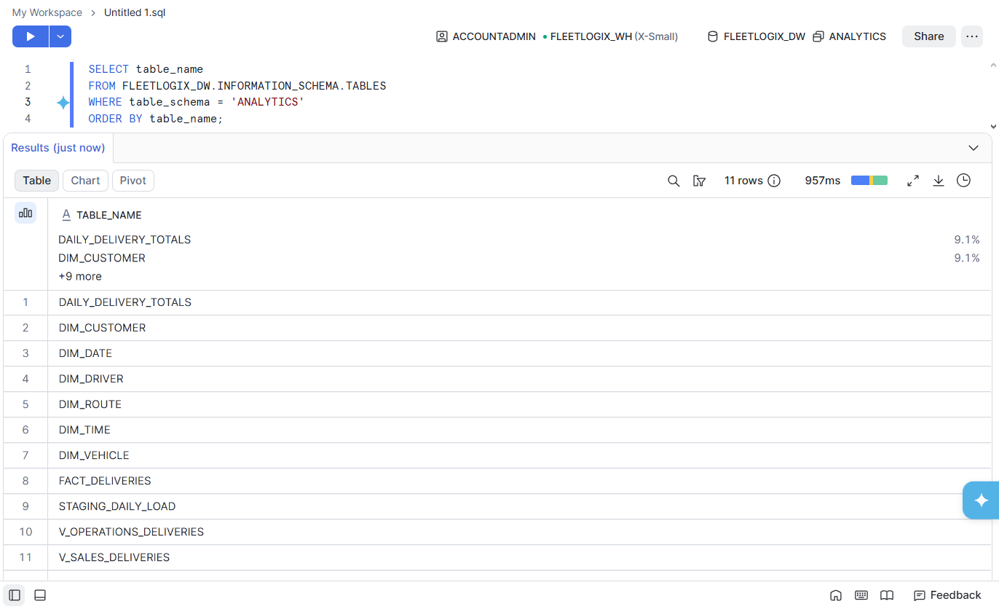
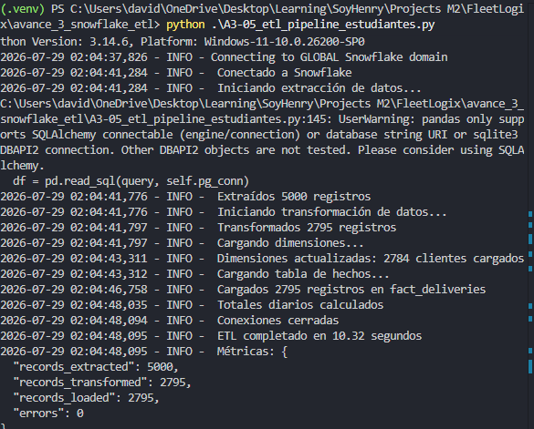
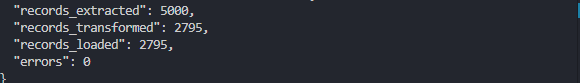

# Avance 3 — Data Warehouse y Pipeline ETL

## FleetLogix

En este avance se diseñó e implementó un **Data Warehouse** en Snowflake junto con un **pipeline ETL** desarrollado en Python para transformar la información operacional de FleetLogix en un modelo orientado al análisis de datos.

El proceso extrae información desde PostgreSQL, realiza las transformaciones necesarias y carga los datos en Snowflake utilizando un modelo dimensional complementado con tablas de apoyo, vistas analíticas y agregaciones diarias.

Este avance constituye la base para la generación de reportes, dashboards y análisis del desempeño logístico de la empresa.

---

# Objetivos

- Diseñar un Data Warehouse para análisis de datos.
- Implementar un proceso ETL completamente automatizado.
- Extraer información desde PostgreSQL.
- Transformar los datos operacionales.
- Cargar el modelo dimensional en Snowflake.
- Generar tablas agregadas para análisis.
- Crear vistas analíticas para facilitar consultas.
- Validar la carga de información.

---

# Tecnologías utilizadas

- Python 3
- PostgreSQL
- Snowflake
- Pandas
- SQLAlchemy
- Snowflake Connector
- SQL
- Logging

---

# Arquitectura del proceso

El pipeline sigue la arquitectura clásica ETL.

```text
PostgreSQL
      │
      ▼
 Extracción
      │
      ▼
 Transformación
      │
      ▼
Carga en Snowflake
      │
      ▼
 Data Warehouse
      │
      ▼
 Vistas y Agregaciones
      │
      ▼
 Dashboards / Analytics
```

---

# Componentes del Data Warehouse

Durante este avance se implementaron los siguientes objetos en Snowflake.

## Dimensiones

- DIM_CUSTOMER
- DIM_DRIVER
- DIM_ROUTE
- DIM_TIME
- DIM_DATE
- DIM_VEHICLE

## Tabla de hechos

- FACT_DELIVERIES

## Tabla de staging

- STAGING_DAILY_LOAD

## Tabla agregada

- DAILY_DELIVERY_TOTALS

## Vistas analíticas

- V_OPERATIONS_DELIVERIES
- V_SALES_DELIVERIES

Esta estructura permite separar claramente la información operacional de la información analítica.

---

# Pipeline ETL

El proceso fue desarrollado mediante el archivo:

```text
A3-05_etl_pipeline_estudiantes.py
```

El flujo del pipeline es el siguiente:

1. Conexión a PostgreSQL.
2. Conexión a Snowflake.
3. Extracción de registros.
4. Transformación de datos.
5. Actualización de dimensiones.
6. Carga de la tabla de hechos.
7. Generación de agregaciones diarias.
8. Registro del proceso mediante logs.

---

# Transformaciones realizadas

Durante la etapa ETL se realizaron diferentes procesos de transformación, entre ellos:

- Conversión de tipos de datos.
- Limpieza de registros.
- Validación de información.
- Construcción de dimensiones.
- Preparación de métricas.
- Generación de tablas agregadas.
- Creación de vistas analíticas.

---

# Flujo de carga

La carga de información sigue el siguiente orden lógico:

```text
PostgreSQL

        │

        ▼

Extracción

        │

        ▼

Transformación

        │

        ▼

Dimensiones

        │

        ▼

Fact_Deliveries

        │

        ▼

Tablas Agregadas

        │

        ▼

Vistas Analíticas
```

Este proceso garantiza que la información llegue al Data Warehouse de manera consistente y organizada.

---

# Resultado de la ejecución

La ejecución final del ETL produjo los siguientes resultados:

| Proceso | Resultado |
|---------|----------:|
| Registros extraídos | 5,000 |
| Registros transformados | 2,795 |
| Clientes cargados en dimensiones | 2,784 |
| Registros cargados en FACT_DELIVERIES | 2,795 |
| Agregaciones diarias | Generadas |
| Errores | 0 |

El pipeline finalizó correctamente sin errores.

---

# Validaciones realizadas

Después de finalizar el proceso se verificó que:

- Las conexiones con PostgreSQL y Snowflake fueron exitosas.
- La extracción se completó correctamente.
- Las transformaciones finalizaron sin errores.
- La carga de la tabla de hechos fue exitosa.
- Se generaron las agregaciones diarias.
- No se presentaron errores durante la ejecución.

---

# Ejecución

## Requisitos

- Python 3
- PostgreSQL
- Snowflake
- Dependencias instaladas

---

## Instalación

```bash
pip install pandas sqlalchemy snowflake-connector-python
```

---

## Configurar conexiones

Actualizar las credenciales correspondientes para:

- PostgreSQL
- Snowflake

---

## Ejecutar

```bash
python A3-05_etl_pipeline_estudiantes.py
```

---

# Estructura del avance

```text
avance_3_snowflake_etl/

│── 04_dimensional_model.sql
│── A3-05_etl_pipeline_estudiantes.py
│── README.md
│
└── evidencias/
```

---

# Evidencias

Las capturas utilizadas para validar este avance se encuentran en:

```text
evidencias/
```

## Objetos creados en Snowflake

Se evidencia la creación del Data Warehouse, incluyendo dimensiones, tabla de hechos, tablas auxiliares y vistas analíticas.



---

## Ejecución del Pipeline ETL

La siguiente captura muestra la ejecución completa del proceso ETL, incluyendo la extracción, transformación y carga de los datos.



---

## Resultado final del proceso

La ejecución final confirma:

- 5,000 registros extraídos.
- 2,795 registros transformados.
- 2,784 clientes cargados.
- 2,795 registros cargados en FACT_DELIVERIES.
- 0 errores durante la ejecución.



---

# Resultados

Se implementó exitosamente un Data Warehouse funcional sobre Snowflake capaz de almacenar información analítica derivada de la operación logística de FleetLogix.

El pipeline ETL automatiza completamente la extracción, transformación y carga de datos desde PostgreSQL, reduciendo el trabajo manual y garantizando consistencia durante todo el proceso.

La incorporación de dimensiones, tablas agregadas y vistas analíticas proporciona una base sólida para la construcción de dashboards y análisis de desempeño empresarial.

Este avance representa la transición desde un modelo transaccional hacia una plataforma preparada para Business Intelligence y análisis de datos.

---

# Autor

**David Cuastumal**

Proyecto Integrador — Módulo 2

SoyHenry