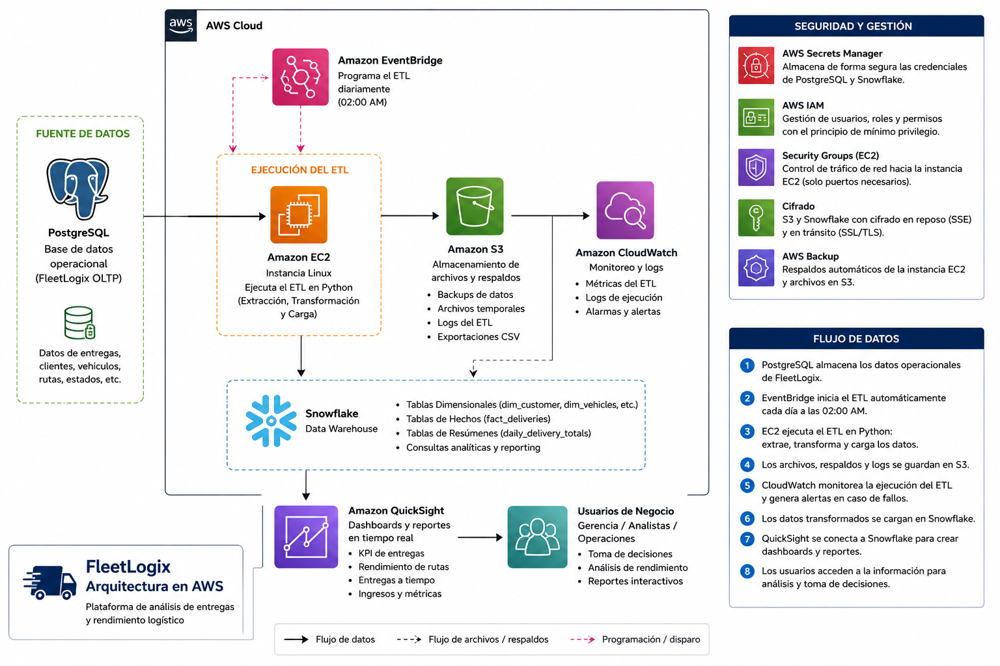

# Avance 4 — Arquitectura Conceptual en AWS

## FleetLogix

En este avance se diseñó una propuesta de arquitectura en la nube para desplegar y automatizar el pipeline de datos desarrollado para **FleetLogix**.

La solución utiliza servicios de Amazon Web Services para ejecutar el proceso ETL, almacenar archivos auxiliares y respaldos, supervisar la operación, proteger las credenciales y facilitar el consumo analítico de la información almacenada en Snowflake.

Este avance corresponde a un **diseño conceptual**. No se desplegaron recursos reales en una cuenta de AWS.

---

# Objetivos

- Diseñar una arquitectura cloud viable para FleetLogix.
- Automatizar la ejecución del pipeline ETL.
- Conectar PostgreSQL con Snowflake.
- Almacenar archivos, logs y respaldos.
- Supervisar el proceso mediante métricas y alertas.
- Proteger las credenciales y controlar los permisos.
- Facilitar la creación de dashboards para los usuarios del negocio.
- Analizar riesgos, costos, seguridad y escalabilidad.

---

# Arquitectura propuesta

La arquitectura mantiene PostgreSQL como base de datos operacional y Snowflake como Data Warehouse.

El pipeline ETL desarrollado en Python se ejecutaría en una instancia de Amazon EC2. Amazon EventBridge Scheduler iniciaría el proceso automáticamente cada día.

Durante la ejecución, el ETL extraería los datos desde PostgreSQL, realizaría las transformaciones y cargaría la información en Snowflake.

Amazon S3 almacenaría archivos temporales, exportaciones, logs y respaldos. Amazon CloudWatch supervisaría la ejecución y generaría alertas en caso de fallos.

Finalmente, Amazon QuickSight podría conectarse a Snowflake para construir dashboards e indicadores destinados a gerencia, analistas y personal de operaciones.

---

# Diagrama de arquitectura



---

# Servicios utilizados

## PostgreSQL

PostgreSQL funciona como la base de datos operacional de FleetLogix.

Almacena la información transaccional relacionada con:

- Vehículos.
- Conductores.
- Rutas.
- Viajes.
- Entregas.
- Mantenimientos.

El pipeline ETL utiliza esta base como fuente de información.

---

## Amazon EventBridge Scheduler

Permite programar automáticamente la ejecución del pipeline.

### Uso en FleetLogix

- Iniciar el ETL diariamente a las 02:00.
- Evitar ejecuciones manuales.
- Configurar reintentos.
- Centralizar la programación del proceso.
- Reducir el riesgo de olvidar una carga.

---

## Amazon EC2

Amazon EC2 proporciona una máquina virtual donde se ejecutaría el pipeline ETL desarrollado en Python.

### Uso en FleetLogix

- Instalar Python y las dependencias del proyecto.
- Ejecutar el script ETL.
- Conectarse a PostgreSQL y Snowflake.
- Realizar las transformaciones.
- Generar archivos y logs.
- Aumentar los recursos de cómputo si crece el volumen de datos.

EC2 fue seleccionado porque permite ejecutar el pipeline actual con cambios mínimos y ofrece control sobre el sistema operativo y el entorno de ejecución.

---

## Amazon S3

Amazon S3 funciona como almacenamiento de objetos para archivos y respaldos.

### Uso en FleetLogix

- Guardar exportaciones CSV.
- Almacenar archivos temporales.
- Conservar logs históricos.
- Mantener respaldos del proceso.
- Facilitar la recuperación ante fallos.
- Aplicar políticas de ciclo de vida y retención.

Una posible estructura del bucket sería:

```text
fleetlogix-data/
│
├── exports/
├── backups/
├── logs/
├── staging/
└── failed-records/
```

---

## Amazon CloudWatch

Amazon CloudWatch permite centralizar logs, métricas y alertas.

### Uso en FleetLogix

- Registrar el inicio y finalización del ETL.
- Detectar errores de conexión.
- Detectar fallos durante las transformaciones.
- Medir la duración del pipeline.
- Supervisar CPU, memoria y almacenamiento de EC2.
- Crear alarmas cuando el proceso falle.
- Facilitar la investigación de incidentes.

---

## AWS IAM

AWS Identity and Access Management controla los usuarios, roles y permisos dentro de AWS.

### Uso en FleetLogix

- Asignar a EC2 únicamente los permisos necesarios.
- Restringir el acceso a S3.
- Controlar el acceso a CloudWatch y Secrets Manager.
- Separar funciones administrativas y operativas.
- Aplicar el principio de mínimo privilegio.

---

## AWS Secrets Manager

AWS Secrets Manager almacena información sensible de manera segura.

### Uso en FleetLogix

- Guardar la contraseña de PostgreSQL.
- Guardar las credenciales de Snowflake.
- Evitar contraseñas escritas directamente en el código.
- Facilitar la rotación de credenciales.
- Controlar qué recursos pueden consultar cada secreto.

---

## AWS Backup

AWS Backup permite administrar políticas de respaldo para recursos compatibles.

### Uso en FleetLogix

- Crear respaldos de los volúmenes asociados a EC2.
- Definir políticas de retención.
- Centralizar la administración de respaldos.
- Complementar los archivos almacenados en S3.
- Reducir el riesgo de pérdida de información.

---

## Snowflake

Snowflake se mantiene como el Data Warehouse del proyecto.

### Uso en FleetLogix

- Almacenar las dimensiones.
- Almacenar la tabla `FACT_DELIVERIES`.
- Mantener agregaciones diarias.
- Ejecutar consultas analíticas.
- Servir como fuente para dashboards.
- Separar almacenamiento y cómputo.

Entre los objetos implementados en Snowflake se encuentran:

- `DIM_CUSTOMER`
- `DIM_DRIVER`
- `DIM_ROUTE`
- `DIM_TIME`
- `DIM_DATE`
- `DIM_VEHICLE`
- `FACT_DELIVERIES`
- `STAGING_DAILY_LOAD`
- `DAILY_DELIVERY_TOTALS`
- `V_OPERATIONS_DELIVERIES`
- `V_SALES_DELIVERIES`

---

## Amazon QuickSight

Amazon QuickSight representa la capa de visualización y Business Intelligence.

### Uso en FleetLogix

- Crear dashboards de entregas.
- Analizar cumplimiento de tiempos.
- Consultar el rendimiento de rutas.
- Visualizar ingresos y peso transportado.
- Comparar vehículos y conductores.
- Facilitar la toma de decisiones.

---

# Flujo de datos

El flujo propuesto es el siguiente:

```text
PostgreSQL
      │
      ▼
EventBridge Scheduler
      │
      ▼
Amazon EC2
      │
      ├──────────────► Amazon S3
      │                  Archivos, logs y respaldos
      │
      ├──────────────► Amazon CloudWatch
      │                  Métricas y alertas
      │
      ▼
Snowflake
      │
      ▼
Amazon QuickSight
      │
      ▼
Usuarios del negocio
```

### Descripción del proceso

1. PostgreSQL almacena los datos operacionales.
2. EventBridge Scheduler inicia el ETL diariamente.
3. EC2 ejecuta el script Python.
4. El pipeline extrae los datos desde PostgreSQL.
5. Python valida, limpia y transforma los registros.
6. Los archivos auxiliares y logs se almacenan en S3.
7. CloudWatch recibe métricas y registros.
8. Los datos transformados se cargan en Snowflake.
9. Snowflake almacena dimensiones, hechos y agregaciones.
10. QuickSight consulta la información.
11. Los usuarios acceden a dashboards e indicadores.

---

# Proceso conceptual de despliegue

## Paso 1 — Preparar el proyecto

- Mantener el código en un repositorio Git.
- Crear el archivo `requirements.txt`.
- Excluir el archivo `.env` mediante `.gitignore`.
- Validar localmente PostgreSQL, Snowflake y el ETL.
- Documentar las variables necesarias.

---

## Paso 2 — Crear la instancia EC2

- Lanzar una instancia Linux.
- Configurar el Security Group.
- Instalar Python y Git.
- Clonar el repositorio.
- Crear el entorno virtual.
- Instalar las dependencias.
- Probar manualmente el pipeline.

---

## Paso 3 — Configurar credenciales

- Guardar los secretos en Secrets Manager.
- Crear un rol IAM para EC2.
- Autorizar únicamente los servicios necesarios.
- Modificar el ETL para consultar las credenciales.
- Eliminar contraseñas escritas directamente en el código.

---

## Paso 4 — Configurar Amazon S3

- Crear un bucket.
- Separar carpetas para logs, respaldos y exportaciones.
- Activar versionado cuando sea necesario.
- Configurar cifrado.
- Definir políticas de retención.
- Aplicar reglas de ciclo de vida.

---

## Paso 5 — Automatizar el proceso

- Crear una programación en EventBridge Scheduler.
- Establecer una ejecución diaria a las 02:00.
- Configurar el mecanismo que inicia EC2 o ejecuta el proceso.
- Añadir reintentos.
- Evitar ejecuciones simultáneas.
- Registrar cada lote mediante un identificador único.

---

## Paso 6 — Configurar monitoreo

- Enviar los logs a CloudWatch.
- Crear alarmas para ejecuciones fallidas.
- Medir la duración del pipeline.
- Supervisar el uso de recursos.
- Definir notificaciones para errores críticos.

---

## Paso 7 — Conectar la capa analítica

- Validar las tablas de Snowflake.
- Revisar dimensiones y tabla de hechos.
- Conectar QuickSight con Snowflake.
- Crear dashboards.
- Asignar permisos según el perfil de usuario.

---

# Seguridad propuesta

La arquitectura considera los siguientes controles:

- Principio de mínimo privilegio con IAM.
- Credenciales fuera del código.
- Uso de Secrets Manager.
- Cifrado en tránsito mediante SSL/TLS.
- Cifrado de archivos almacenados en S3.
- Restricción de puertos mediante Security Groups.
- Rotación periódica de contraseñas.
- Registros de auditoría.
- Separación entre desarrollo y producción.
- Autenticación multifactor para usuarios administrativos.
- Políticas de respaldo y recuperación.
- Exclusión del archivo `.env` del repositorio.

---

# Riesgos y mitigaciones

| Riesgo | Descripción | Impacto | Mitigación |
|---|---|---:|---|
| Pérdida de datos | Eliminación accidental, corrupción o fallo durante la carga. | Alto | Respaldos, versionado en S3 y funciones de recuperación de Snowflake. |
| Exposición de credenciales | Contraseñas almacenadas en el código o en archivos públicos. | Alto | Secrets Manager, variables de entorno y rotación de claves. |
| Acceso no autorizado | Usuarios o servicios con permisos excesivos. | Alto | IAM, mínimo privilegio, roles separados y MFA. |
| Fallo de EC2 | La instancia se detiene o deja de responder. | Alto | Alarmas, reinicio automático y procedimiento de recuperación. |
| Fallo del ETL | Error durante la extracción, transformación o carga. | Alto | Logs, validaciones, transacciones, reintentos y alertas. |
| Duplicación de datos | El pipeline se ejecuta más de una vez. | Medio | Claves únicas, cargas idempotentes y control de lotes. |
| Costos inesperados | Recursos activos sin control. | Medio | AWS Budgets, apagado programado y alarmas de consumo. |
| Fallos de conexión | Interrupción entre PostgreSQL, AWS y Snowflake. | Medio | Reintentos, logs y ventanas alternativas de ejecución. |
| Datos sensibles en logs | Los registros pueden contener información privada. | Alto | Enmascaramiento, cifrado y retención limitada. |
| Configuración de red incorrecta | Puertos innecesarios abiertos. | Alto | Security Groups restrictivos y conexiones cifradas. |
| Dependencia de proveedores | Dependencia de AWS y Snowflake. | Medio | Formatos exportables, documentación y respaldos independientes. |
| Transferencia entre regiones | Mayor latencia y costos de transferencia. | Medio | Seleccionar regiones cercanas y compatibles. |

---

# Disponibilidad y recuperación

Para mejorar la continuidad del servicio se propone:

- Mantener respaldos periódicos.
- Conservar logs históricos.
- Configurar alarmas.
- Documentar el procedimiento de restauración.
- Utilizar identificadores de lote.
- Diseñar cargas idempotentes.
- Mantener scripts de configuración.
- Probar periódicamente la recuperación.
- Conservar copias independientes de archivos críticos.

---

# Escalabilidad

La arquitectura puede crecer junto con FleetLogix:

- EC2 puede aumentar CPU y memoria.
- S3 puede almacenar grandes volúmenes de archivos.
- Snowflake permite escalar el cómputo independientemente del almacenamiento.
- QuickSight puede incorporar nuevos usuarios.
- EventBridge puede programar múltiples procesos.
- El pipeline puede dividirse en tareas independientes.
- Los procesos críticos podrían migrarse en el futuro a servicios administrados.

---

# Costos

El costo final dependerá de:

- Región de AWS.
- Tipo de instancia EC2.
- Tiempo de ejecución.
- Cantidad de datos almacenados en S3.
- Retención de logs en CloudWatch.
- Número de secretos.
- Usuarios de QuickSight.
- Consumo del warehouse de Snowflake.
- Transferencia de datos.

Para una demostración académica se recomienda:

- Utilizar una instancia pequeña.
- Apagar EC2 cuando no sea necesaria.
- Limitar la retención de logs.
- Aplicar políticas de ciclo de vida en S3.
- Suspender automáticamente el warehouse de Snowflake.
- Configurar AWS Budgets.
- Eliminar recursos de prueba después de utilizarlos.

No se establece un costo fijo porque las tarifas dependen de la configuración, la región y el consumo.

---

# Decisiones de diseño

## ¿Por qué Amazon EC2?

El ETL ya está desarrollado en Python y utiliza conectores específicos para PostgreSQL y Snowflake.

EC2 permite ejecutar el código con cambios mínimos y mantener control sobre el entorno de ejecución.

---

## ¿Por qué Amazon S3?

S3 proporciona una ubicación centralizada para:

- Respaldos.
- Archivos temporales.
- Exportaciones.
- Logs históricos.
- Registros fallidos.

También permite versionado, cifrado y políticas de ciclo de vida.

---

## ¿Por qué EventBridge Scheduler?

Permite reemplazar la ejecución manual por una programación administrada.

También facilita:

- Reintentos.
- Control centralizado.
- Horarios definidos.
- Automatización del pipeline.

---

## ¿Por qué Snowflake?

El proyecto ya utiliza un modelo dimensional en Snowflake.

Mantener Snowflake como Data Warehouse evita reconstruir la capa analítica y permite escalar el procesamiento de consultas.

---

## ¿Por qué Amazon QuickSight?

QuickSight permite transformar la información del Data Warehouse en dashboards accesibles para usuarios de negocio.

Su función dentro de la arquitectura es proporcionar una capa visual para el análisis y la toma de decisiones.

---

# Beneficios de la solución

- Automatiza el pipeline ETL.
- Reduce tareas manuales.
- Centraliza el monitoreo.
- Protege las credenciales.
- Facilita el almacenamiento de respaldos.
- Permite escalar el procesamiento.
- Proporciona una fuente analítica central.
- Facilita la creación de dashboards.
- Mejora la detección de errores.
- Favorece la recuperación ante incidentes.
- Apoya la toma de decisiones.

---

# Alcance del avance

Este avance representa una propuesta conceptual.

No se desplegaron recursos reales en AWS.

El trabajo realizado incluye:

- Investigación de servicios.
- Selección de herramientas.
- Diseño del flujo de datos.
- Creación del diagrama técnico.
- Identificación de riesgos.
- Definición de controles de seguridad.
- Propuesta de monitoreo.
- Análisis conceptual de costos.
- Estrategia de despliegue.
- Evaluación de escalabilidad y recuperación.

---

# Código de referencia

Se incluyen scripts de referencia para una posible implementación futura con
Amazon RDS, DynamoDB, Lambda, SNS, API Gateway y Kinesis.

Estos recursos no fueron desplegados durante el proyecto. La arquitectura
principal propuesta utiliza EC2 para ejecutar el pipeline ETL, S3 para
almacenamiento auxiliar, CloudWatch para monitoreo y Snowflake como
Data Warehouse.

---

# Estructura del avance

```text
avance_4_arquitectura_aws/
│
├── README.md
├── diagrama_arquitectura_aws_fleetlogix.png
│
└── codigo_referencia/
    ├── A4-06_aws_setup.py
    └── A4-lambda_functions.py
```

El diagrama puede permanecer directamente en la carpeta principal. En ese caso no es necesario duplicarlo dentro de `evidencias`.

La estructura recomendada sería:

```text
avance_4_arquitectura_aws/
│
├── README.md
└── diagrama_arquitectura_aws_fleetlogix.png
```

---

# Evidencia

## Diagrama técnico de la arquitectura

La siguiente imagen representa los servicios, conexiones, controles de seguridad y flujo de datos propuestos para FleetLogix.


---

# Conclusión

La arquitectura propuesta permite trasladar el pipeline de FleetLogix a un entorno cloud escalable, automatizado y supervisado.

Amazon EC2 ejecutaría el proceso ETL, EventBridge Scheduler iniciaría las cargas, Amazon S3 almacenaría archivos y respaldos, CloudWatch centralizaría el monitoreo y Secrets Manager protegería las credenciales.

Snowflake continuaría funcionando como Data Warehouse, mientras que Amazon QuickSight proporcionaría la capa de visualización para los usuarios de negocio.

Aunque la solución introduce riesgos relacionados con seguridad, costos, disponibilidad y dependencia de servicios externos, estos pueden reducirse mediante controles de acceso, cifrado, monitoreo, respaldos, alertas y buenas prácticas operativas.

Esta propuesta completa el flujo de datos de FleetLogix, desde la base operacional hasta una plataforma analítica preparada para generar indicadores y apoyar la toma de decisiones.

---

# Autor

**David Cuastumal**

Proyecto Integrador — Módulo 2  
SoyHenry